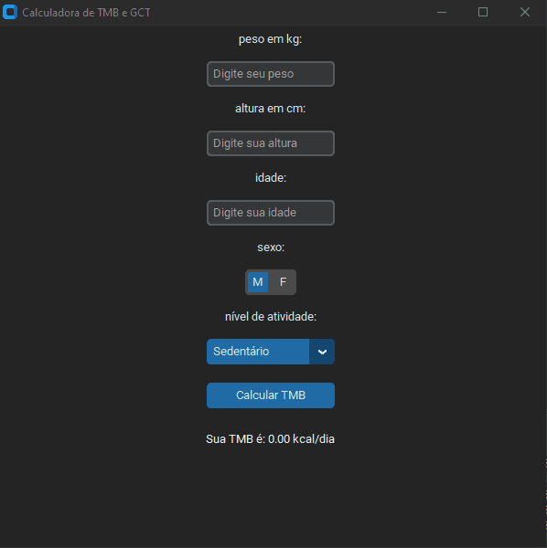

🔥 Calculadora de TMB

Aplicação desktop desenvolvida em Python utilizando CustomTkinter, criada para calcular a Taxa Metabólica Basal (TMB) e estimar o Gasto Calórico Total (GCT) de acordo com os dados informados pelo usuário.

O projeto foi desenvolvido como uma aplicação prática para estudos de Python, interfaces gráficas e lógica de programação.

 # 🔥 Calculadora de TMB

Calculadora de Taxa Metabólica Basal desenvolvida em Python utilizando CustomTkinter.

## 🎥 Demonstração

O GIF acima demonstra o funcionamento da aplicação.

✨ Funcionalidades
🧮 Cálculo da Taxa Metabólica Basal (TMB)
🔥 Estimativa do Gasto Calórico Total (GCT)
👤 Seleção do sexo
🎂 Entrada da idade
⚖️ Entrada do peso
📏 Entrada da altura
🏃 Seleção do nível de atividade física
✅ Validação dos dados informados
🖥️ Interface gráfica desenvolvida com CustomTkinter
🛠️ Tecnologias utilizadas
🐍 Python
🎨 CustomTkinter
🖼️ Tkinter
🔧 Git
📦 GitHub
📋 Pré-requisitos

Para executar o projeto, é necessário ter o Python 3.x instalado.

Verifique a instalação executando:

python --version

🚀 Instalação
1. Clone o repositório
git clone https://github.com/renanhenricson/calculadora_tmb_v2.git

2. Entre na pasta do projeto
cd calculadora_tmb_v2

3. Instale as dependências

Caso exista um arquivo requirements.txt:

pip install -r requirements.txt

Ou instale o CustomTkinter diretamente:

pip install customtkinter

▶️ Como executar

Execute o arquivo principal da aplicação:

python app.py

Após executar o comando, a janela da calculadora será aberta.

📖 Como utilizar
1. Informe seu sexo

Selecione uma das opções disponíveis:

Masculino
Feminino
2. Informe seu peso

Digite o peso em quilogramas (kg).

Exemplo:

75

3. Informe sua altura

Digite a altura em centímetros (cm).

Exemplo:

175

4. Informe sua idade

Digite sua idade em anos.

Exemplo:

25

5. Selecione seu nível de atividade

Escolha uma das opções disponíveis:

Nível	Fator
Sedentário	1.2
Levemente ativo	1.375
Moderadamente ativo	1.55
Altamente ativo	1.725
Extremamente ativo	1.9
6. Realize o cálculo

Após preencher todos os campos, clique no botão de cálculo.

A aplicação apresentará:

TMB: 1714.25 kcal/dia
Gasto Total: 2657.09 kcal/dia

Os valores acima são apenas um exemplo.

🧮 Como o cálculo funciona?

A aplicação realiza dois cálculos principais:

🔥 1. Taxa Metabólica Basal (TMB)

O cálculo varia de acordo com o sexo informado.

👨 Masculino
TMB = 88.36
    + (13.4 × peso)
    + (4.8 × altura)
    - (5.7 × idade)

👩 Feminino
TMB = 447.6
    + (9.2 × peso)
    + (3.1 × altura)
    - (4.3 × idade)

Onde:

Peso = quilogramas (kg)
Altura = centímetros (cm)
Idade = anos
⚡ 2. Gasto Calórico Total (GCT)

Depois de calcular a TMB, a aplicação utiliza o fator correspondente ao nível de atividade física selecionado.

GCT = TMB × Fator de Atividade

Fatores utilizados
Sedentário              → 1.2
Levemente ativo         → 1.375
Moderadamente ativo     → 1.55
Altamente ativo         → 1.725
Extremamente ativo      → 1.9

📌 Exemplo de cálculo

Considere:

Sexo: Masculino
Peso: 75 kg
Altura: 175 cm
Idade: 25 anos
Atividade: Moderadamente ativo

A TMB será calculada como:

TMB = 88.36
    + (13.4 × 75)
    + (4.8 × 175)
    - (5.7 × 25)

Resultado aproximado:

TMB ≈ 1.790 kcal/dia

Como o nível de atividade é Moderadamente ativo, o fator utilizado será 1.55.

Então:

GCT = 1790 × 1.55

GCT ≈ 2.774 kcal/dia

A aplicação exibirá os dois valores:

TMB: 1790.00 kcal/dia
Gasto Total: 2774.50 kcal/dia

⚠️ Os valores apresentados pela aplicação são estimativas e possuem finalidade educacional. Para avaliação nutricional individualizada, procure um profissional qualificado.

🧠 Tratamento de erros

A aplicação possui uma validação básica dos dados inseridos.

Caso algum campo contenha um valor inválido ou não numérico, será apresentada uma mensagem:

Preencha todos os campos corretamente.

Isso evita que a aplicação seja encerrada devido a erros de conversão de dados.

📂 Estrutura do projeto
calculadora_tmb_v2/
│
├── app.py
├── README.md
├── requirements.txt
│
└── assets/
    └── calculadora.gif

🎯 Objetivos do projeto

Este projeto foi desenvolvido para praticar:

Programação em Python
Desenvolvimento de aplicações desktop
CustomTkinter
Criação de interfaces gráficas
Funções
Estruturas condicionais
Dicionários
Tratamento de exceções
Entrada e validação de dados
Cálculos matemáticos
Git e GitHub
🔮 Melhorias futuras

Algumas funcionalidades que podem ser implementadas futuramente:

 Cálculo do IMC
 Histórico dos cálculos
 Botão para limpar os campos
 Exportação dos resultados
 Personalização do tema
 Melhorias na interface
 Mais opções de cálculo relacionadas à composição corporal
👨‍💻 Autor

Renan Henricson

Projeto desenvolvido para fins de aprendizado e prática em desenvolvimento de aplicações desktop com Python.

📄 Licença

Este projeto está disponível para fins educacionais.